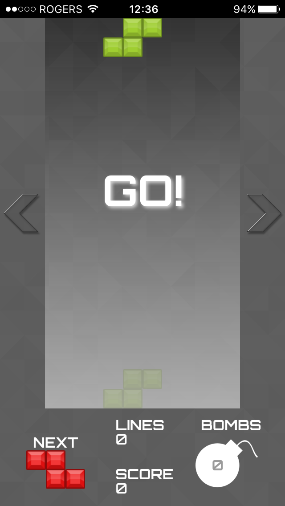
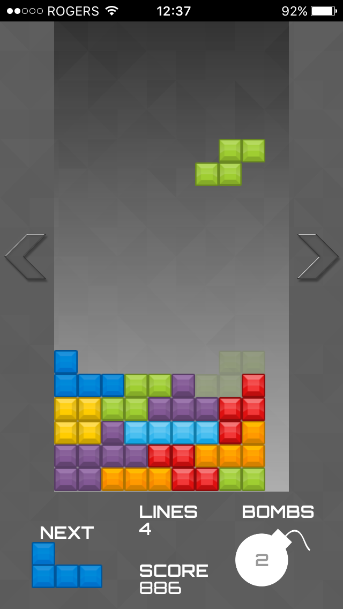
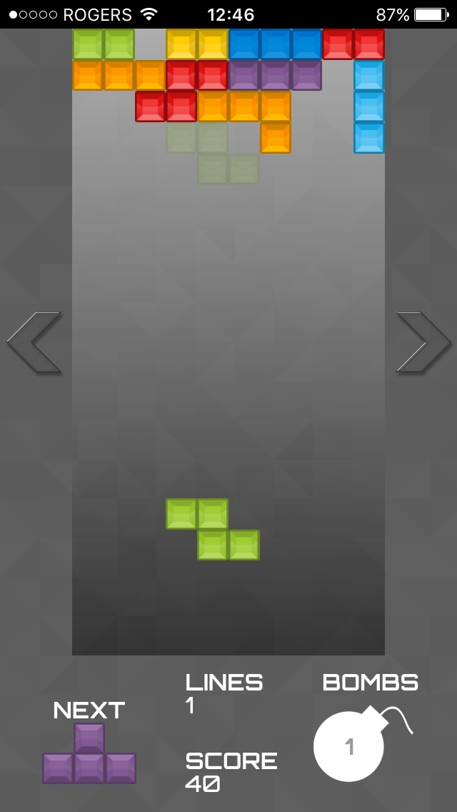
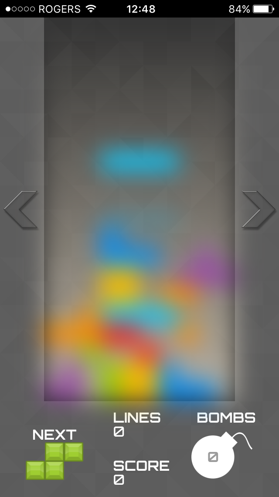
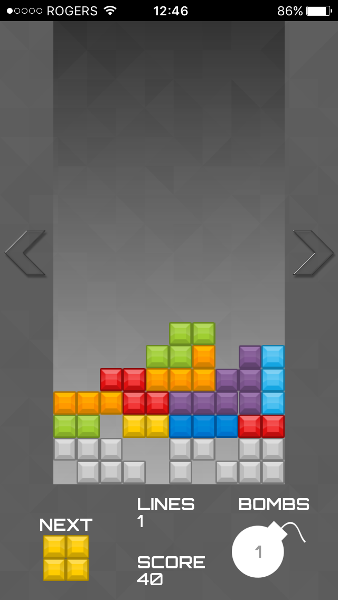

#BOMBTRIS
=========

Bombtris is a fast-paced multiplayer Tetris clone. Players can accumulate bombs by clearing lines and then release the bombs randomly in hopes of hindering the other player's performance.

The interface and all of the game logic was built entirely using JavaScript in React. CSS transforms and transitions are used for game effects. The players’ games are passed to the server through web sockets and can be viewed live on a Megatron screen.

Built with React.js, Hammer.js, Node.js, Express.js, Socket.io

[Bombtris](http://bombtris.herokuapp.com/ "Bombtris")
 
[Bombtris Admin](http://bombtris.herokuapp.com/admin "Bombtris Admin")
 
[Bombtris Megatron](http://bombtris.herokuapp.com/megatron "Bombtris Megatron")
